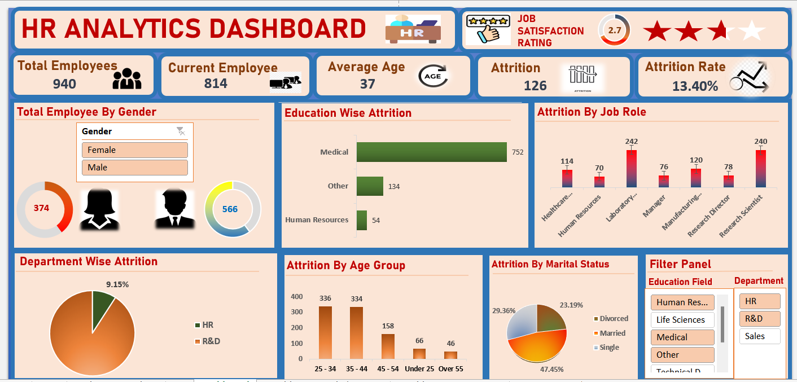

# Employee-Attrition-Analysis-Excel
Interactive HR Analytics Dashboard built in Microsoft Excel to analyze employee attrition, workforce demographics, job satisfaction, and retention trends.
# HR Analytics Dashboard

## Project Overview

Developed an interactive HR Analytics Dashboard in Microsoft Excel to analyze employee attrition, workforce demographics, job satisfaction, and departmental performance.

## Business Problem

The objective was to identify key factors contributing to employee attrition and provide actionable insights for HR decision-making.

## Tools Used

- Microsoft Excel
- Pivot Tables
- Pivot Charts
- Slicers
- Conditional Formatting

## Key KPIs

- Total Employees: 940
- Current Employees: 814
- Attrition Count: 126
- Attrition Rate: 13.40%
- Average Age: 37

## Business Questions

1. What is the overall attrition rate?
2. Which departments experience the highest attrition?
3. Which job roles have the highest employee turnover?
4. How does employee satisfaction affect attrition?
5. Does compensation impact retention?
6. How does career progression affect attrition?

## Key Insights

- Attrition Rate: 13.40%
- Male Employees: 566
- Female Employees: 374
- Largest workforce segment: Age 25–34
- Married employees represent 47.45% of workforce

## Dashboard Preview

## Project Files
Dashboard.xlsx
Dashboard_Report.pdf
Dashboard Screenshot(s)
README.md

- Dashboard.xlsx
- Dashboard_Report.pdf
- Dashboard Screenshots
